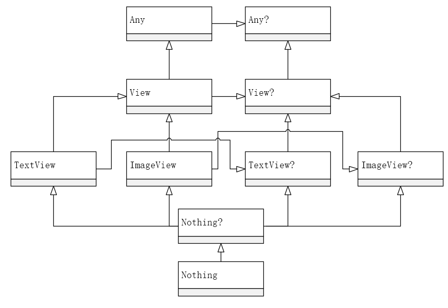

# 函数基础

## 函数声明和使用

我们在学习新的编程语言时，第一个程序往往是“Hello，World！”。在Kotlin中，只要一个函数就可以实现这个程序：

```kotlin
// SomeFile.kt
fun main(args: Array<String>) { // 声明了一个参数args，Kotlin_1.3.72版本之后将不再需要该参数
    println("Hello, World!") // 该函数等同于Java中的System.out.println
}
```

我们已经简单看到了一个函数是什么样子的，并且我们不用任何类就可以声明和使用它。一个函数由`fun`关键字、声明在括号里的参数和函数体组成，我们再来看一个有返回值的函数：

```kotlin
fun sum(a:Int,b:Int):Int{ // 与Java不同,返回值的类型定义在函数名称和参数表之后
    return a + b
}
```


在Java中，我们把类似的结构称作**方法**（Method），现在我们称作**函数**（Function）。它们之间的区别是这样的：

* 函数是指依照函数名调用的一段代码。而方法是和类（对象）的实例所关联的一个函数，有时又叫它成员函数。
* 简而言之，类内部的函数被称为方法。 一般说来，在Java中只有方法，但是学者有时会说静态Java方法实际上是函数。 在Kotlin中，我们定义函数可以不与任何对象相关联。


Kotlin调用函数的语法和Java等大部分编程语言类似：

```kotlin
val total = sum (12,24)//调用sum函数赋值给total变量
```

## 顶层函数

定义在文件顶层的函数被称为顶层函数，上节中的`main`函数就是顶层函数。如果想在其它文件中使用顶层函数，和Java一样使用`import`语句导入即可（在Android Studio等的现代的IDE中，导入操作会自动完成）：

```kotlin
// Test.kt
package com.example
fun printValue(v:Any?) {
    print(v)
}
// Main.kt
import com.example.printValue
fun main(args: Array<String>) {
    printValue(8)
}
```

我们知道Kotlin在Android平台会编译为Java字节码，在Android5.0之前运行在Dalvik虚拟机上，在5.0之后运行在ART（Android RunTime）上。这两种虚拟机都只执行定义在类中的函数，为了解决这个问题，编译器会为我们自动生成一个类，类名是原文件名加上Kt后缀，了解这个之后我们就知道如何在Java文件中使用上面的`printValue`函数：

```kotlin
TestKt.printValue(8)
```

可以预见的是这个生成类的默认的命名方式可能会重名，或者影响可读性。我们可以在文件开始（包名之前）使用注解来指定生成类的名称：

```kotlin
@file:JvmName("Test")
```

这样生成类的名称为`Test`而不是`TestKt`了。我们还可以使多个Kotlin文件编译成同一个类：

```kotlin
// Max.kt
@file:JvmName("Math")
@file:JvmMultifileClass
package com.example.math
fun max(n1: Int, n2: Int): Int = if(n1 > n2) n1 else n2
// Min.kt
@file:JvmName("Math")
@file:JvmMultifileClass
package com.example.math
fun min(n1: Int, n2: Int): Int = if(n1 < n2) n1 else n2
```

我们可以在Java中这样使用：

```kotlin
Math.min(1, 2)
Math.max(1, 2)
```

## 参数

在函数的声明中，每个参数都必须明确指定其类型。所有参数都被定义为不可变类型（只读）且无法被定义为可变的，因为可变类型的参数容易出错且在Java中经常被程序员误用。如果我们确实需要一个可变类型变量，那么可以在函数体中声明一个具有相同名称局部变量来作为影子变量：

```kotlin
fun findDuplicates(list: List<Int>): List<Int> {
    var list = list.sorted()
    //...
}
```

我们可以这么做，但会显示警号，因为这样的重复命名让我们难以定位问题并降低了代码的可读性。一个更好的办法是用数据的内容来命名参数，用数据的目的来命名变量，这两者在大多数情况下是不同的：

```kotlin
fun findDuplicates(originList<Int>): List<Int> {
    var sortedList = originList.sorted()
    //...
}
```


我们一直在使用参数这个术语，实际上它是有两种类型的：**形参**（Parameters）和**实参**（Arguments）。以我们第一节末尾使用的`sum`函数来说：

* 形参指的是在函数声明中定义的变量，指的是`sum`函数声明时声明的`a`和`b`。
* 实参指的是在调用函数时传进去的实际值，指的是在调用`sum`函数时传入的`12`和`24`.


和Java中一样，实参是可以传入形参的子类型的。如果我们声明形参类型为`Any?`，那么我们可以传入任何值：

```kotlin
fun show(arg: Any?) {
    println("Hello. It is: $arg")
}
show(null)
// 打印结果: Hello. It is: null
show(1)
// 打印结果: Hello. It is: 1
show("Skr")
// 打印结果: Hello. It is: Skr
```

## 可变参数

有些时候，我们在生命函数时并不知道要处理的参数的具体数目，在这种情况下，我们可以使用`vararg`修饰符修饰一个参数，这样这个参数就可以接受任意数量的参数：

```kotlin
fun printSum(vararg numbers: Int) {
    val sum = numbers.sum()
    print(sum)
}
printSum(1,2,3,4) // 打印结果: 10
printSum(1) // 打印结果: 1
printSum() // 打印结果: 0
```

实参中所包含的数据可以在函数体内部视为一个数组，数组的类型对应着参数的数据类型，一般来说，数组的数据类型会是泛型类`Array<T>，`但在上例中我们使用的是`Int`类型的参数，Kotlin有一个优化过的数组类型`IntArray`，Kotlin会自动使用这个更佳的选择：


我们仍然可以在可变参数之前声明普通的参数：

```kotlin
fun printAll(prefix: String, postfix: String, vararg texts: String){
    val allTexts = texts.joinToString(", ")
    println("$prefix$allTexts$postfix")
}
printAll("All texts: ","!" , "Hello", "World")
// 打印结果: All texts: Hello, World!
```

当我们使用可变参数时，可以一个一个地传参，也可以使用**延展操作符**（spread operator）一次性传进去整个数组：

```kotlin
printSum(1,2,3,4) // printSum函数定义参见本节开头，打印结果：10
val numbers = intArrayOf(1, 2, 3)
printSum(*numbers) // 打印结果：6
printSum(1,*numbers,2) // 打印结果：9
```

需要注意的是，一个函数只可以有一个可变参数。

## 函数的返回类型

在Kotlin中，所有函数都是有返回值的，如果没有指定函数的返回类型，它的返回值默认为`Unit`类型。为了演示起见，我们可以显式声明出来：

```kotlin
fun printSum(a: Int, b: Int): Unit {//在实际编码中，可以省略Unit声明
    val sum = a + b
    print(sum)
}
```

`Unit`对象等价于Java中的`void`，可以被视作为一个普通的对象，可以赋值给其他变量：

```kotlin
val v = printSum(12, 24)
println(v is Unit) // 打印结果: true
```

`Unit`是一个单例，所以下列三个命题均为真：

```kotlin
println(p is Unit) //打印结果: true
println(p == Unit) // 打印结果: true
println(p === Unit) // 打印结果: true
```

使用不带任何值的`return`语句即可返回`Unit`类型：

```kotlin
fun printSum(a: Int, b: Int) { // 没有显式指定返回类型的情况下就会隐式设为Unit类型
    if(a < 0 || b < 0) {
        return // 函数的返回语句
    }
    val sum = a + b
    print(sum)
    // 函数执行完毕会自然返回，我们不必再使用函数返回语句
}
```

如果我们指定了`Unit`之外的返回类型，那么需要显式地使用返回语句，否则将视为错误：

```kotlin
fun sumPositive(a: Int, b: Int): Int {
    if(a > 0 && b > 0) {
        return a + b
    }
    // 错误，if条件不满足时函数没有显式的返回语句
}
```

简单地加上一个返回语句即可修复此问题：

```kotlin
fun sumPositive(a: Int, b: Int): Int {
    if(a > 0 && b > 0) {
        return a + b
    }
    return -1
}
```

## Nothing返回类型

有些时候我们希望定义一个永远抛出异常的函数，比如：

* 在异常处理系统比较重要的项目中，并且需要在异常发生的时候提供更多的信息
* 在单元测试中抛出异常，以测试我们代码的异常处理能力

这时候我们可以用到一个特殊类`Nothing`，`Nothing`是一个虚类型（uninhabited type），无法拥有实例。一个返回类型为`Nothing`的函数将不会返回任何值并永远无法运行到`return`语句，只会抛出异常。

让我们看一个简单的例子：

```kotlin
fun fail(): Nothing = throw Error()
```

这样的函数用起来就像一个`throw`语句，但是它拥有独特的返回类型，能让我们写出更具表现力的代码：

```kotlin
fun getFirstCharOrFail(str: String): Char
                       = if(str.isNotEmpty()) str[0] else fail()
val name: String = getName() ?: fail()
val enclosingElement = element.enclosingElement 
                       ?: throwError ("Lack of enclosing element")
```

为什么这个函数能被赋值为`char`、`String`以及自定义的各种类型呢？这是因为`Nothing`是所有数据类型的子类：



## 单表达式函数

我们在实际的开发中，许多函数仅仅只有一个表达式，比如我们要获取某个控件上的文本：

```kotlin
fun getEmail(): String {
    return emailView.text.toString()
}
```

这种类型的代码在Android项目中随处可见，下面是一些常见的使用场景：

* 提取一些小的操作
* 使用多态来为一个类提供特定的值
* 在不同的架构层之间传递数据（上面的例子就可能出现在MVP设计模式中，用于View层与Presenter层传递数据）
* 基于递归的函数式编程风格函数

Kotlin中提供了一个改进的表示方法，当一个函数只包含一个表达式时，我们可以省略函数体，直接使用等号来指定表达式，这样定义的函数称为单表达式函数。

我们来用新的方式声明前面的函数：

```kotlin
fun getEmail() = emailView.text.toString()
```

这时候返回类型也成为了一个可选项，因为编译器可以从表达式中推断出来。

在Android的视图操作中，我们经常会与视图的Id打交道，来看看它怎么发挥作用：

```kotlin
class AddressAdapter : ItemAdapter<AddressAdapter.ViewHolder>() {
    override fun getLayoutId() = R.layout.choose_address_view
    override fun onCreateViewHolder(itemView: View) = ViewHolder(itemView)
    // ...
}
```

有时我们需要根据交互的视图来执行相应的操作：

```kotlin
override fun onOptionsItemSelected(item: MenuItem): Boolean = when{
    item.itemId == android.R.id.home -> {
        onBackPressed()
        true
    }
    else -> super.onOptionsItemSelected(item)
}
```

在链式操作一些数据时：

```kotlin
fun textFormatted(text: String, name: String) = text
                  .trim()
                  .capitalize()
                  .replace("{name}", name)
```

可以看到这个特性能让我们的代码更加简洁，更具可读性。单表达式函数在Android开发和函数式编程中的应用十分广泛。


**命令式编程**（Imperative programming）与**声明式编程**（Declarative programming）

* 命令式编程：这种编程范式描述的是执行一个操作所需的确切的步骤，非常直观。
* 声明式编程：这种编程范式描述的是预期的结果而不是实现的步骤，这意味着这种编程风格大多使用表达式或者声明，而非语句来完成。**函数式编程**（Functional programming）和**逻辑编程**（Logic programming）都被视作声明式编程风格，声明式编程通常比命令式编程更短，更具可读性。


## 尾递归函数（Tail-recursive function）

**递归函数**（Recursive function）是指调用自身的函数，比如：

```kotlin
fun getState(state: State, n: Int): State =
    if (n <= 0) state 
    else getState(nextState(state), n - 1)
```

递归函数是函数式编程的重要组成部分，问题是每个递归函数的调用需要将前一个函数的返回地址保存在栈上，如果递归进行地太深（栈上的函数太多）时会抛出`StackOverflowError`。

经典的解决办法是使用遍历来代替递归：

```kotlin
fun getState(state: State, n: Int): State {
    var state = state
    for (i in 1..n) {
        state = state.nextState()
    }
    return state
}
```

但是由于遍历和递归在思路上有着本质的区别，所以更适当的解决方式是使用像Kotlin这样的现代编程语言提供的尾递归函数。尾递归函数是一种特殊的递归函数，该函数将调用自身作为执行的最后一个操作（换句话说，递归发生在函数的最后一个操作中）。这使我们可以优化编译器进行的递归调用，并以更加有效的方式执行递归操作，而且无需担心潜在的`StackOverflowError`。要使函数尾递归，我们需要用tailrec修饰符标记它：

```kotlin
tailrec fun getState(state: State, n: Int): State =
    if (n <= 0) state
    else getState(state.nextState(), n - 1)
```

为了弄清楚它的工作原理，我们将它编译后再反编译为Java代码，我们可以看到这些（代码经过简化）：

```kotlin
public static final State getState(@NotNull State state, int n){
    while(true) {
        if(n <= 0) {
            return state;
        }
        state = state.nextState();
        n = n - 1;
    }
}
```

可以看到底层实现方式仍是遍历，这就是为什么不会出现`StackOverflowError`。但在编写代码时我们可以用递归的思想去编写，使用递归的代码往往会更加简洁。

使用尾递归函数要满足三个条件：

* 函数只能在执行最后一个操作时调用自身
* 不能在`try` / `catch` / `finally`代码块中使用
* 在撰写本文时，仅允许Kotlin编译为JVM平台代码时使用

## 本地函数（Local functions）

和本地变量类似，定义在函数体中的函数称为本地函数。

```kotlin
fun printTexts() {
    fun printText() { // printText是一个本地函数，它定义在printTexts函数里面
        print("Hello,World!")
    }
    printText()
}
printText() // 错误，本地函数在定义的函数体之外不可用
```

本地函数可以直接访问所定义函数体中的变量，不需要进行传参：

```kotlin
fun printTexts() {
    var texts: List<String> = emptyList()
    fun doWork() {
        for(text in texts){// 可以直接访问texts
            print(text)
        }
    }
    doWork()
}
```

本地函数适用于提取仅在某个函数中使用的共有操作，需要使用到某个函数中参数、本地变量等的操作。

## 有选择地传参

有些时候我们调用一个函数只需要传入其中部分参数，在Java中，我们会定义相同方法的多个重载来完成不同传参的调用需求。重载导致的一个问题是方法数会以排列组合的量级增长，这会使代码难以维护。重载还要求重载的函数之间要有不同的参数表区分彼此，参数名称不同而参数数据类型相同的重载无法实现。所以我们在开发时经常需要在函数体中处理不同的传参可能。

因此我们在使用Java编码时经常会调用传入许多空值的方法：

```kotlin
layoutInflater.createView(context,name,null,null)
```

Kotlin提供了**默认参数**（Default argument）和**命名参数语法**（named argument syntax），事情就变得不一样了。

### 默认参数

Kotlin的默认参数和C++中的工作方式一样，当调用函数时如果没有提供某个参数值，默认的参数值就会发挥作用。定义方式也与C++中类似：

```kotlin
fun printValue(value: String, inBracket: Boolean = true,
               prefix: String = "", suffix: String = "") {
    print(prefix)
    if (inBracket) {
        print("(${value})")
    } else {
        print(value)
    }
    println(suffix)
}
```

我们可以像没有默认参数那样传入所有值来进行调用，也可以省略传入若干个有默认值的参数：

```kotlin
printValue("test", true, "","") // 打印结果: (test)
printValue("test") // 打印结果: (test)
printValue("test", false) // 打印结果: test
```

### 命名参数语法

即使加上了默认参数，但仍然有一个问题是如果想传入一个参数，就必须将前面的参数一并传入。有些时候我们希望只传靠后的参数而不传前面的，那么我们可以使用命名参数语法指定传入的参数：

```kotlin
printValue("test", true, "", "!") // 传统方式，打印结果: (test)!
printValue("test", suffix = "!") // 命名参数方式，打印结果: (test)!
```

在使用命名参数语法时，我们还可以随意调整传参顺序而不会对程序产生任何影响：

```kotlin
printValue(value = "test", suffix = "!") // 打印结果: (test)!
printValue(suffix = "!", value = "test") // 打印结果: (test)!
```

这样的调用方式更加灵活，无需重载函数，就可以让我们随意选择必要的参数以想要的顺序传入，同时也更具可读性。

我们还可以将默认参数语法和经典的语法结合起来使用，但是只要使用了命名参数语法，下一个参数就不能使用经典参数语法了：

```kotlin
printValue ("test", inBracket = true, prefix = "") // 正确
printValue ("test", inBracket = true, "") // 错误
```

需要注意的是，命名参数语法也为我们带来了一些额外的考虑，如果我们更改参数的名称，可能会使项目产生一些错误，特别是我们在做一个库的时候，更应该小心更改参数名称。

命名参数语法不能在调用Java函数时使用，因为Java字节码并不总是保留参数的名称（Java8引入了编译器保留参数名称的新特性）。

