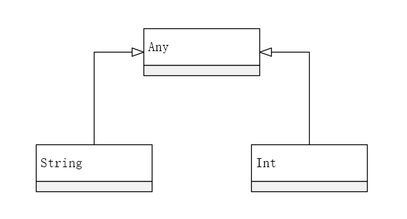

# Kotlin基础

## 变量

在Kotlin中有两种变量：`var`（variable）和 `val`（value）。`var`是可变的，即可以在初始化赋值之后可以被重新赋值，等同于Java中的普通变量。

```text
fun main() {
    var fruit: String = "orange" //创建变量fruit并初始化赋值orange
    fruit = "banana" //将fruit变量重新赋值为banana
}
```

`val`是不可变的，即在初始化赋值之后不能被重新赋值，相当于Java中带`final`修饰符的变量。但它不能保证引用的对象中的值不会被修改（重新赋值）：

```text
class Fruit(var name:String)//类的声明会在第四章中说明
fun main() {
    val fruit = Fruit("orange")//创建变量fruit并初始化
    fruit = Fruit("banana")//错误，不能进行重新赋值
    fruit.name = "banana"//正确，引用中对象的值可以被修改
}
```

由于`val`变量可以有一个自定义getter，所以我们也不能保证每一次的访问就是返回的都是同一个对象：

```text
val random: Int
get() = Random().nextInt()//自定义getter将会在第四章中说明
```


Kotlin是允许在文件级别定义变量和函数的，而Java必须要在类中定义。


## 类型推断

和Java中不同，Kotlin的变量类型声明在变量名之后：

```text
var fruit: String
```

虽然第一眼看起来很奇怪，但是这个结构是Kotlin类型推断的重要组成部分。类型推断就是编译器可以根据上下文来推断变量的数据类型，比如当变量声明和初始化写在一起时，我们可以省略类型声明。

```text
var fruit: String = "orange"//完整声明
var fruit = "orange"//省略类型声明
```

上面虽然类型声明被省略了，但数据类型会被隐式地设置为`String`，因为Kotlin是强类型的语言。在随后的使用中编译器会验证是否符合正确的数据类型：

```text
var fruit = "orange"
fruit = 10 //错误，fruit被推断为String类型，无法赋值int类型数据
```

我们可以通过显式声明两者都适用的数据类型使上面的赋值成立：

```text
var fruit: Any = "orange"
fruit = 10
```

`Any`相当于`Java`中的Object，处于继承层级的顶端。

编译器同样可以从函数进行类型推断：

```text
var total = sum(10, 20)
```

有时候我们自己并不确定编译器到底给这个变量设置了什么数据类型，这个类型可能是`Int`，也可能是`Double`或者`Float`，我们可以将插入符置于变量名上，按快捷键（Windows中的是**Shift + Ctrl + P**，macOS中的是**arrow key + control + P**）显示具体推断成何种数据类型：


类型推断同样适用于泛型：

```text
var persons = listOf(personInstance1, personInstance2)
```

假设我们传入的是`Person`类，那么上面的推断类型就为`List<Person>`。

再比如`Pair`泛型类的推断：

```text
var pair = "Everest" to 8848 // 推断类型为 Pair<String, Int>
```

类型推断还能在更复杂的场景中工作，比如根据一个被推断好的类型来进行推断：

```text
var map = mapOf("Everest" to 8848, "Mont Blanc" to 4810)
// 推断类型为 Map<String, Int>
var map = mapOf("Everest" to 8848, "Mont Blanc" to "4810")
// 推断类型为 Map<String, Any>
```

`Map`的类型由`Pair`的类型推断而来，`Pair`的类型由传进去参数的类型推断而来。当传入不同类型的参数时，编译器会寻找最近的共有类型。在上面的例子中编译器选择了`Any`，因为`String`和`Int`都继承自`Any`：



我们可以看到，类型推断可以很好地帮我们精简一部分代码，减少一些工作。但我们有时还是需要手动明确声明数据类型：

```text
var time = 18 //使用整数时，默认的推断类型是Int
var time: Long = 18 //显示声明数据类型为Long
var time = 18L //用字面常量（literal constant）声明数据类型为Long
```


[关于字面常量是什么及译法](http://blog.sina.com.cn/s/blog_5d29ee450102w85l.html)


因为Kotlin是强类型语言，当编译器缺少信息确定变量的数据类型时，我们就需要显式声明它，否则将被视为错误：

```text
var name //错误，编译器无法得知它会存储什么类型的值
```

## 严格空类型安全（Strict null safety）

在使用Java开发时，最常见的错误就是空指针异常（NullPointerExceptions）。Sir Tony Hoare在2009年3月的Qcon技术会议上发表了题为“Null引用：代价十亿美元的错误”的演讲，回忆自己1965年设计第一个全面的类型系统时，未能抵御住诱惑，加入了Null引用，仅仅是因为实现起来非常容易。它后来成为许多程序设计语言的标准特性，导致了数不清的错误、漏洞和系统崩溃，可能在之后40年中造成了十亿美元的损失。

为了避免空指针异常，我们需要编写防御性的代码，在使用一个对象前检查它是否为空。包括Kotlin在内的许多现代编程语言采取了行动，将这种运行时的错误转化为编译时错误以提升编程语言的安全性。Kotlin实现这个目的的途径就是为语言类型增加**可空性安全机制**（nullability safeness mechanisms），Kotlin的类型系统会区分**可空类型**（nullable type）和**非空类型**（non-nullable type），这样可以在开发期间检测和预防非常多的空指针异常。

严格空类型安全是Kotlin类型系统的一部分。默认类型是非空的，如果想存储可能为空的数据必须要显式声明它是可空类型的：

```text
val age: Int = null //错误，默认类型不可为空
val name: String? = null //正确，加?后缀标记是一个可空变量
```

可空类型的引用不能直接调用方法，除非在调用前进行了非空检查：

```text
val name: String? = null
// ...
name.toUpperCase() // 错误，引用可能为空
```

每一个非空类型都有一个对应的可空类型：`Int`对应`Int?`、`String`对应`String?`等。这个规则也适用于所有Android Framework中的类（`View`对应`View?`）、第三方库中的类（`OkHttpClient`对应`OkHttpClient?`）、自定义的类（`MyCustomClass`对应`MyCustomClass?`），也就是说每个非泛型类都定义两种类型：可空类型和非空类型，非空类型是它对应的可空类型的子类：


`Nothing`是一个虚类型（uninhabited type），无法拥有实例。这样的继承结构也说明了为什么非空类型可以复制给它对应的可空类型，反之则不行：

```text
var nullableVehicle: Vehicle?
var vehicle: Vehicle
nullableVehicle = vehicle // 正确
vehicle = nullableVehicle // 错误，nullableVehicle可能为空
```

泛型类则有更多的可能，以`ArrayList`为例：

| 类型声明 | ArrayList自身是否可空 | ArrayList中的元素是否可空 |
| :--- | :--- | :--- |
| ArrayList&lt;Int&gt; | 否 | 否 |
| ArrayList&lt;Int&gt;? | 是 | 否 |
| ArrayList&lt;Int?&gt; | 否 | 是 |
| ArrayList&lt;Int?&gt;? | 是 | 是 |

让我们来看一个使用Java开发Android时常见的错误：

```text
//Java
@Override
public void onCreate(Bundle savedInstanceState) {
    super.onCreate(savedInstanceState);
    savedInstanceState.getBoolean("theKey");
}
```

这段代码会通过编译，但会在运行时崩溃并抛出空指针异常。我们知道，`Activity`在第一次创建时该方法会被传进去一个`null`，只有在用一个保存的状态重新创建`Activity`时该值才会不为空。

我们看一下上面的代码用Kotlin写会怎样：

```text
//Kotlin
override fun onCreate(savedInstanceState: Bundle?) {
    super.onCreate(savedInstanceState)
    savedInstanceState.getBoolean("theKey") // 错误
}
```

这段代码将无法通过编译，因为Kotlin不允许不检查可空引用就调用它的方法。

我们加上空值检查就可以解决这个问题：

```text
override fun onCreate(savedInstanceState: Bundle?) {
    super.onCreate(savedInstanceState)
    
    val locked: Boolean
    if(savedInstanceState != null)
        locked = savedInstanceState.getBoolean("theKey")
    else
        locked = false
}
```

虽然这种处理方式在Java中司空见惯，但这样写代码无法让人一眼就能看出它的含义。现在Kotlin允许用更简洁的方式处理这类问题，比如**安全调用操作符**（safe call operator）。

## **安全调用操作符**（safe call operator）

安全调用操作符由一个问号和点表示（`?.`）。如果操作符左侧为空则返回空值，否则返回右侧的表达式的执行结果：

```text
override fun onCreate(savedInstanceState: Bundle?) {
    super.onCreate(savedInstanceState)
    val locked: Boolean? = savedInstanceState?.getBoolean("theKey")
}
```

如果`savedInstanceState`为空，返回空值，反之则返回`savedInstanceState?.getBoolean("theKey")`的执行结果。

在Java代码中常常见到的嵌套空值检查，也可以用Kotlin中的安全调用操作符写得更简明：

```text
//Java
Boolean isCorrect;
if(quiz != null ){
    if(quiz.currentQuestion != null) {
        if(quiz.currentQuestion.answer != null ) {
            isCorrect = quiz.currentQuestion.answer.isCorrect();
        }
    }
}
//Kotlin
val isCorrect= quiz?.currentQuestion?.answer?.isCorrect
```

在上面的调用链中，当任何一个安全调用操作符左侧为空就会返回空值。有时我们想在取得的对象为空时也能有一个默认值，除了经典的`if`-`else`解决方案，我们还可以用更简洁的**猫王操作符**（Elvis operator）。

## **猫王操作符**（Elvis operator）

猫王操作符由一个问号和冒号表示（`?:`）。它的语法是：`first operand ?: second operand`。它的执行逻辑是当第一个操作数不为空时返回**第一个操作数**（first operand），否则返回**第二个操作数**（second operand）。

有了它我们可以很方便地为上节例子加上默认值（false）：

```text
override fun onCreate(savedInstanceState: Bundle?) {
    super.onCreate(savedInstanceState)
    val locked: Boolean = savedInstanceState?.getBoolean("theKey") ?: false
}
```

还可以用在上节第二个例子：

```text
val isCorrect = quiz?.currentQuestion?.answer?.isCorrect ?: false
```

并且编译器会智能地将`isCorrect`推断为非空类型。


[关于猫王操作符名称的由来](http://dobsondev.com/2014/06/06/the-elvis-operator/)


## 非空断言操作符（not-null assertion operator）

非空断言操作符由两个叹号组成（`!!`）。这个操作符可以显式地将可空类型转化为非空类型：

```text
var testStr: String? = "test"
var size: Int = testStr!!.length
```

一般来说，Kotlin不允许我们直接访问可空类型变量`testStr`的属性`length`。当我们用非空断言操作符显式将其转换为非空类型就可以直接访问了。然而如果我们的判断错误，那么程序将会在运行时抛出空指针异常。

```text
override fun onCreate(savedInstanceState: Bundle?) {
    super.onCreate(savedInstanceState)
    val locked: Boolean = savedInstanceState!!.getBoolean("theKey")
}
```

上面的代码会编译通过，但是我们知道，当一个新创建的`Activity`时，它的`savedInstanceState`将会是空，此时上面的代码会抛出空指针异常。

看到非空断言操作符时，它意味着潜在的空指针异常，此时代码的工作方式更像Java。所以我们必须小心地使用它，大部分情况应该被安全调用和智能类型转换来代替。我们还可以利用`let`函数来处理可空性问题。


关于非空断言操作符的使用建议：[https://medium.com/@igorwojda/kotlin-combating-non-null-assertions-5282d7b97205](https://medium.com/@igorwojda/kotlin-combating-non-null-assertions-5282d7b97205)


## `let`函数

