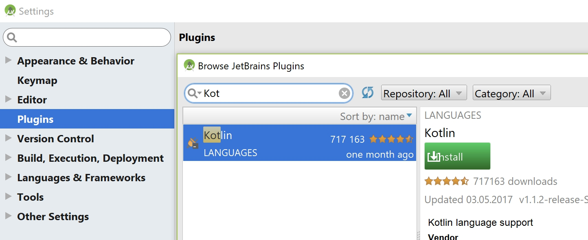
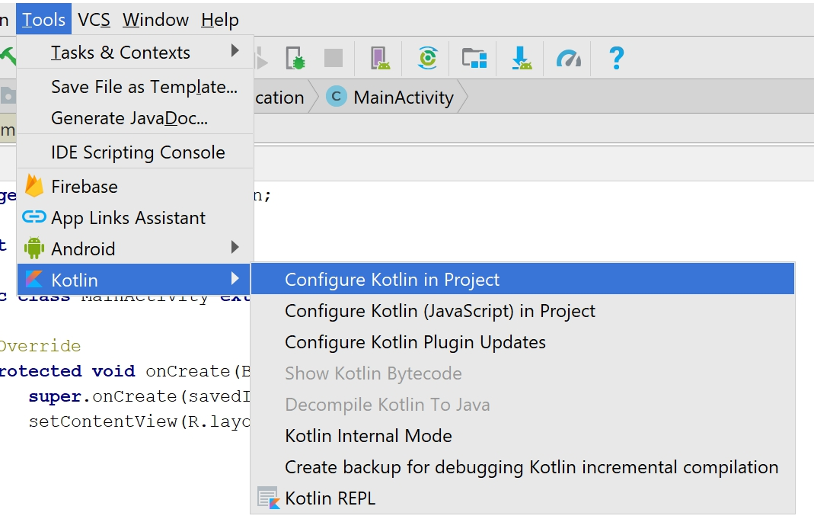
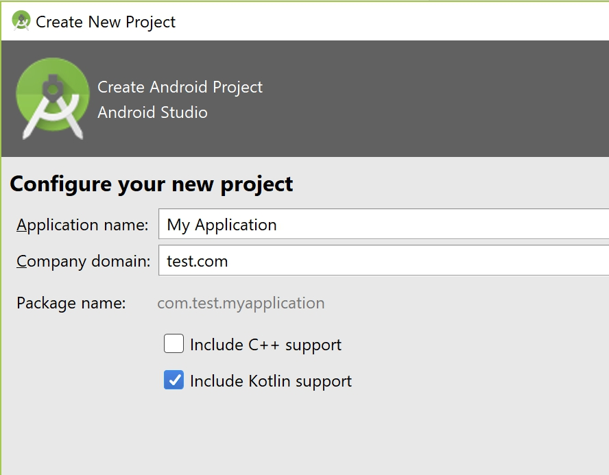
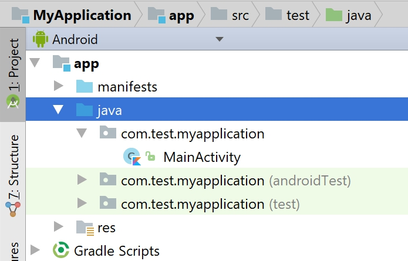
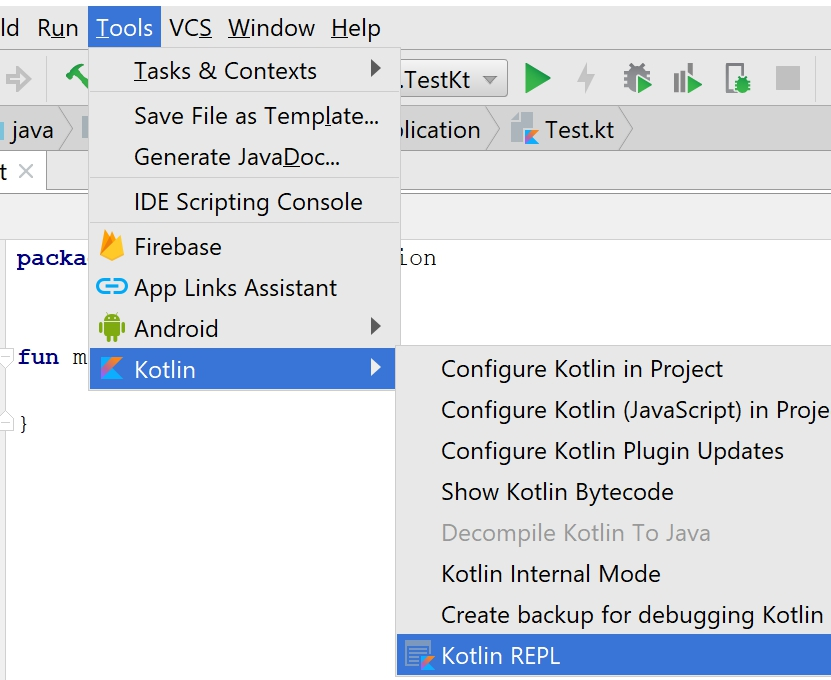

# Kotlin上手

## 来和Kotlin认识一下

让我们看看Kotlin的一些优势：

* **安全**：Kotlin在**可空性**（nullability）和**不变性**（immutability）方面提供了更加安全的特性。Kotlin是静态类型语言，因此在编译时就知道每个表达式的类型，编译器可以验证我们尝试访问某个类实例的任何属性或方法。与之相似的是，Java也是静态类型的，但是与Java不同，Kotlin类型系统更严格（安全）。 我们必须明确告诉编译器给定的变量可以存储空值。 这样可以使程序在编译时甚至在编写代码时报出错误，而不是在运行时抛出**空指针异常**（NullPointerException）。
* **易于调试**：使用Kotlin能在开发阶段更快地发现程序错误，这比在程序发布后产生崩溃损害用户体验好多了。Kotlin可以很方便地处理不可变的数据，例如它把**可变集合**（mutable collections）和**不可变集合**（immutable collections）区分开来，提供了不同的操作接口（在底层实现中，集合仍然是可变的）。
* **简洁**：Kotlin消除了大部分Java的冗余代码，同样的编程任务Kotlin需要的代码更少。因此，Kotlin写出的代码更具表现力，更容易阅读和理解。
* **互操作性**：Kotlin旨在与Java无缝并行工作（跨语言项目）。现有Java库和框架的生态系统与Kotlin一起使用而不会有任何性能损失。许多Java库甚至推出了Kotlin特定的版本，以符合Kotlin的习惯用法。 无需任何特殊语法Kotlin类可以在Java代码中直接实例化并透明地引用，反之亦然。 这使我们能够轻松地将Kotlin纳入现有的Android项目，与Java一起使用。
* **工具友好**：可用任何 Java IDE 或者使用命令行构建，例如Android Studio、IntelliJ Idea、Eclipse和Standalone Compiler。并能使用现代IDE优秀高效的代码编辑功能。
* **跨平台**：我们可以面向许多平台，包括移动应用程序 （Android甚至iOS）、服务器端应用程序（后端）、Web开发（前端 ）、数据科学、桌面应用程序，甚至构建系统（Gradle）。

Kotlin团队致力于使Kotlin插件变得越来越好。Kotlin大多数错误都已快速修复并且实现了开发者社区要求的许多功能。


Kotlin 中文站：[https://www.kotlincn.net/](https://www.kotlincn.net/)

Kotlin bug跟踪:：[https://youtrack.jetbrains.com/issues/KT](https://youtrack.jetbrains.com/issues/KT) 

Kotlin slack频道： [http://slack.kotlinlang.org/](https://surveys.jetbrains.com/s3/kotlin-slack-sign-up)


使用Kotlin进行Android程序开发变得越来越高效和愉快，Kotlin与JDK 6兼容，因此即使Android4之前的Android设备中，使用Kotlin创建的应用程序也可以安全运行。

Kotlin旨在通过结合**过程式编程**（procedural programming）和**函数式编程**（functional programming）的概念和元素以带来两全其美的编程体验。 它遵循许多准则，如每个Java开发人员的必读书籍——约书亚·布洛赫（Joshua Bloch）撰写的《Effective Java》。

最重要的是，Kotlin是开源的，因此我们可以查验该项目并积极参与到Kotlin项目的各个方面，例如Kotlin插件、编译器、文档或Kotlin语言本身。

## 来看一些Kotlin的示例

对于Android开发者来说，Kotlin非常容易上手，因为它就像是Java语言的升级版。这一部分我们主要展现使用Kotlin能达到什么样的效果，即使没有完全理解也没关系，我们会在接下来的章节详细讨论它们。

让我们从变量声明开始：

```text
var name = "Mamun" // 推断类型为 String
name = "Andecy"
```

请注意，Kotlin不必在句尾使用分号，但如果使用了分号也不会引起任何错误，分号是一个可选项而非强制性的语法。我们也不必声明变量的类型，因为编译器可以从上下文中推断出变量的类型。Kotlin是强类型的语言，所以每一个变量只能有一种适当的类型：

```text
var name = "Mamun"
name = 2 // 错误, 因为 name 的类型是 String
```

这个变量已经被推断为`String`，所以赋值给它一个**整型**（integer）会产生一个**编译时错误**（compilation error）。接下来让我们看看Kotlin如何使用**字符串模板**（string templates）来更好地拼接字符串：

```text
val name = "Mamun"
println("My name is $name") // 打印结果: My name is Mamun
```

我们不再需要字符“+”来拼接字符串，用Kotlin，我们可以轻松地将单个变量甚至整个表达式转换为字符串：

```text
val name = "Mamun"
println("My name is ${name.toUpperCase()}") // 打印结果: My name is MAMUN
```

在Java中，任何变量都可以存储**空值**（null）。而在Kotlin中，**严格空类型安全**（strict null safety）要求我们必须明确地标记每一个变量是否可以存储空值。

```text
var a: String = "abc"
a = null // 编译时错误
var b: String? = "abc"
b = null // 正确
```

在数据类型之后加一个问号，我们就可以标记一个变量是可以存储空值的（`String`/`String?`）。如果我们不明确标记某一个变量是可空的，那么它将不能被任何一个可空的**引用**（reference）赋值。Kotlin提供了合适的方法来处理可空的变量——我们可以使用**安全调用**（safe call）**操作符**（operator）来进行操作：

```text
savedInstanceState?.doSomething
```

方法`doSomething`仅会在`savedInstanceState`有非空值的时候被调用，否则该方法调用将无效。这就是Kotlin避免Java中常见的空指针异常的有力手段。

Kotlin也提供了一些新的数据类型，我们可以用`Range`数据类型定义一个闭区间区域：

```text
for (i in 1..10) {
    print(i)
} // 打印结果: 12345678910
```

Kotlin引入了含有**中缀符**（infix notation）的`Pair`数据类型，我们可以存储一些常见的成对数据：

```text
val capital = "BeiJing" to "China"
println(capital.first) // 打印结果: BeiJing
println(capital.second) // 打印结果: China
```

上面示例中的关键字`to`就是中缀符，我们还可以通过**解构声明**（destructive declaration）将其解构为单独的变量，甚至用它遍历列表：

```text
val (city, country) = capital
println(city) // 打印结果: BeiJing
println(country) // 打印结果: China

val capitals = listOf("BeiJing" to "China", "NewYork" to "America")
for ((city, country) in capitals) {
    println("Capital of $country is $city")
}
// 打印结果:
// Capital of China is BeiJing
// Capital of America is NewYork
```

我们也可以使用`forEach`函数遍历列表：

```text
val capitals = listOf("BeiJing" to "China", "NewYork" to "America")
capitals.forEach { (city, country) ->
    println("Capital of $country is $city")
}
```

Kotlin通过一组接口和辅助方法（`List`/`MutableList`、`Set`/`MutableSet`、`Map`/`MutableMap`...）来区分可变与不可变集合:

```text
val list = listOf(1, 2, 3, 4, 5, 6) // 推断类型为 List
val mutableList = mutableListOf(1, 2, 3, 4, 5, 6) // 推断类型为 MutableList
```

不可变集合意味着集合初始化后其状态就不可改变，我们无法添加或移除数据项。可变集合意思就很明显了，我们可以改变它的状态。

通过使用lambda表达式，我们可以非常简洁地使用Android Framework：

```text
view.setOnClickListener {
    println("Click")
}
```

Kotlin标准库\(stdlib\)包含着很多可以高效简洁地处理集合的函数，使我们可以轻松地在列表上进行**流处理**（stream processing）：

```text
val text = capitals.map { (_, country) -> country.toUpperCase() }
                   .onEach { println(it) }
                   .filter { it.startsWith("C") }
                   .joinToString (prefix = "Countries prefix C:")
// 打印结果: 
// CHINA
// AMERICA
println(text) // 打印结果: Countries prefix C:CHINA
```

我们也可以定义自己的lambda，以全新方式编写代码。下面这个lambda使我们能够在Android Marshmallow或更高版本中运行特定的代码：

```text
inline fun supportsMarshmallow(code: () -> Unit) {
    if(Build.VERSION.SDK_INT >= Build.VERSION_CODES.M)
    code()
}
//用法
supportsMarshmallow {
    println("This code will only run on Android Marshmallow and newer")
}
```

智能类型转换使我们无需执行冗余的强制类型转换就能编写相应的代码：

```text
if (x is String) {
    print(x.length) // x 已自动转换为 String
}
x.length //错误, 在if代码块之外 x 不会自动转换为 String
if (x !is String)
return
x.length // x 已自动转换为 String
```

Kotlin编译器在执行类型检查之后，就知道了变量x的类型为`String`。因此它自动将其转换为`String`类型，从而允许其调用`String`类的所有方法并访问`String`类的所有属性，无需再进行任何显式强制转换。

有时，一个函数的功能仅是返回一个表达式的值。这种情况我们可以用表达式的语法来代替函数体：

```text
fun sum(a: Int, b: Int) = a + b
println (sum(2 + 6)) // 打印结果: 8
```

使用**默认参数语法**（default argument syntax），我们可以为每个参数定义一个默认参数：

```text
fun printMessage(fruit: String, amount: Int = 0, name: String = "Anonymous") {
    println("$name has $amount $fruit")
}
printMessage("apples") // 打印结果: Anonymous has 0 apples
printMessage("apples", 10) // 打印结果: Anonymous has 10 apples
printMessage("apples", 10, "Andecy") // 打印结果: Andecy has 10 apples
```

唯一的限制是我们需要提供不带默认值的所有参数。 我们还可以使用**命名参数语法**（named argument syntax）来指定函数参数的值：

```text
printMessage("oranges", name = "Mamun")
```

在一个函数有多个参数的情况下，这样调用还可以提升代码的可读性。

我们在开发中常常需要为数据模型创建大量的类，Kotlin提供了一种非常简单的方法来定义和操作数据模型类，只需要在类声明前加上`data`**修饰符**（modifier）：

```text
data class Ball(var size:Int, val color:String)
val ball = Ball(12, "Red")
println(ball) // 打印结果: Ball(size=12, color=Red)
```

我们不需要`new`关键字来进行类的实例化，我们可以很容易地创建该类的副本：

```text
val smallBall = ball.copy(size = 3)
println(smallBall) // prints: Ball(size=3, color=Red)
smallBall.size++
println(smallBall) // prints: Ball(size=4, color=Red)
println(ball) // prints: Ball(size=12, color=Red)
```

可以看到我们可以很容易地处理不可变的对象。

Kotlin有一个非常棒的特性——**扩展**（extensions）。它让我们可以为一个已经存在的类添加新的行为（属性或方法），无需更改其原本的实现，无需继承，也无需代理。有时当我们使用一个库或框架，想为一个特定的类添加额外的方法或属性时，扩展是一个非常好的选择。扩展减少了代码的冗余，是以前Java中大量存在的工具类（例如，`StringUtils`类）更好的实现方式。我们可以很容易地为自定义类、第三方库、Android Framework类添加扩展。

Android `ImageView`没有从网络加载图像的功能，因此我们可以使用Picasso库（一个Android平台的图片加载库）为`ImageView`添加扩展方法来实现此功能：

```text
fun ImageView.loadUrl(url: String) {
    Picasso.with(context).load(url).into(this)
}
//用法
imageView.loadUrl("www.test.com\\image0.png")
```

我们也可以实现一个简单的`Toast`的拓展：

```text
fun Context.toast(text:String) {
    Toast.makeText(this, text, Toast.LENGTH_SHORT).show()
}
//用法 (Activity 类内部)
toast("Hello")
```

Kotlin中的**接口**（interface）可以有默认的实现：

```text
interface UserData {
    val email:String
    val name:String
    get() = email.substringBefore("@")
}
```

在许多Android程序中，我们希望将对象的初始化延迟到第一次使用它的时候。为了做到这一点，我们可以使用**代理**（delegate）：

```text
val retrofit by lazy {
    Retrofit.Builder()
            .baseUrl("https://www.github.com")
            .build()
}
```

Retrofit（一个非常受欢迎的Android网络框架）属性初始化将被延迟到第一次访问该值时。延迟初始化可能会加快Android程序的启动。这是初始化一个类中多个对象的好方法，特别是（根据应用使用情况）某个对象不是一直需要或者不是所有的对象都需要的时候。

管中窥豹，可见一斑。以上是Kotlin特性的简单介绍，我们会在本书的余下部分详细讨论如何更好地利用Kotlin的能力。


运行Kotlin最快的方法是使用[Kotlin Playground](https://play.kotlinlang.org/)。点击链接，无需下载任何软件，而且可以方便地在各个Kotlin版本之间切换，很容易在上面测试Kotlin的各种语言特性。

与Java类似，main函数是Kotlin应用程序的入口。而Android应用程序具有多个入口， main函数是被Android Framework隐式调用的，因此我们无法使用它来运行Android平台上的Kotlin代码。


## 在Android Studio中使用Kotlin

Android Studio现有的工具也适用于Kotlin。使用这些工具，我们可以很方便地进行调试、代码检查、代码补全以及重构等等，几乎和使用Java的时候一样。最大的改变就是Kotlin的语法，我们需要做的就是给项目配置Kotlin。

Android应用程序具有多个入口（不同的`inetnt`可以启动程序中不同的组件），且需要Android Framework依赖。运行书籍中的代码示例需要继承`Activity`类并在其中放置代码。

### 给旧项目配置Kotlin

Android Studio 3.0起提供了对Kotlin完整的工具支持，无需额外下载安装任何软件包。

在Android Studio 2.x版本中使用Kotlin必须手动安装Kotlin插件，在Android Studio中选择 **File \| Settings \| Plugins \| Install JetBrains plugin**，输入Kotlin并点击install：



安装完成需要重启，待重启之后我们需要在项目中配置Kotlin，进行**Configure Kotlin in project** 操作（Windows中的快捷键是 **Ctrl+Shift+A**，macOS中是 **command + shift + A**），也可以在菜单中点击**Tools \| Kotlin \| Configure Kotlin in Project**：



然后选择**Android with Gradle**：


最后选择所配置的**模组**（Module）的Kotlin版本：


点击 **Sync Now** 同步一下就完成了：


这样，我们就可以在配置好的模组中编写Kotlin代码了。

### 在新项目中使用Kotlin

只需要在创建时勾选 **Include Kotlin support** 即可：



我们可以看到Kotlin的代码源文件放在Java的源文件夹下，我们可以另建一个Kotlin源文件夹，但这不是必需的：



### 用转换器将Java转换为Kotlin（J2K）

使用 **Java to Kotlin converter \(J2K\)** 有两种方式：

第一种是使用快捷键（Windows中的是 **Alt + Shift + Ctrl + K ，**macOS中的是 **option + shift + command + K**）。

另一种是把Java代码粘贴到新建的Kotlin文件中，它就会转换为Kotlin代码（有弹窗提示）。这在学习Kotlin时非常有用，我们可以先把代码用Java写好然后进行转换，由于Kotlin和Java的互操作性，我们甚至可以一个文件一个文件地逐步过渡到Kotlin。

### Kotlin Read Eval Print Loop（REPL）

Kotlin REPL是一个Shell，可以快速地帮你验证Kotlin代码。当你需要运行一段独立于Android Framework的Kotlin代码时，它就非常趁手了，因为它比进行App调试快得多：



### 简介Kotlin编译原理

Kotlin可以被编译为**Java字节码**（Java bytecode）然后转成**Dalvik字节码**（Dalvik bytecode）。Kotlin是跨平台的，但我们主要看一下在Android平台的编译流程：


也就是说，Java编译器的编译结果和Kotlin编译器的编译结果会在字节码层面合并到一起。在纯Java项目或纯Kotlin项目中，就只有一个对应的编译器工作了。

